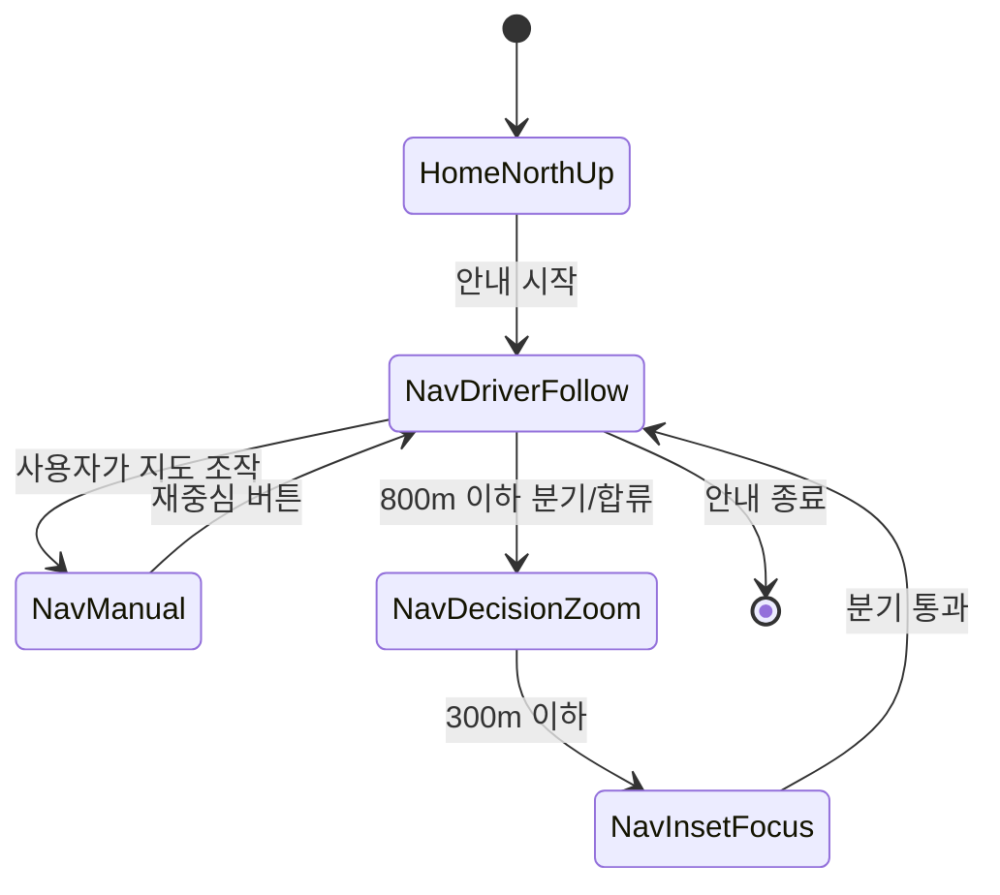
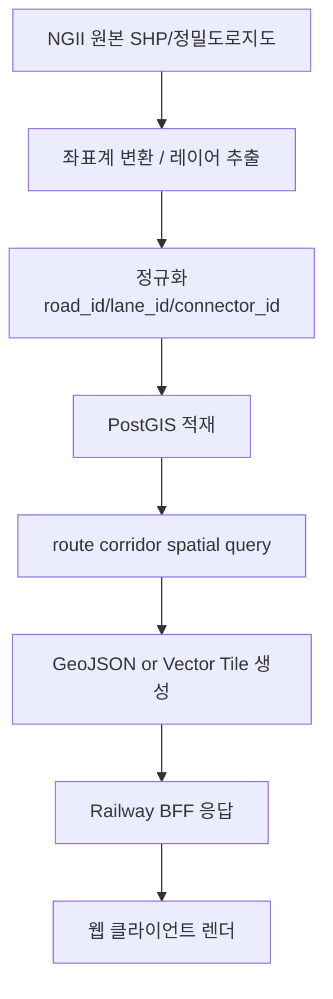
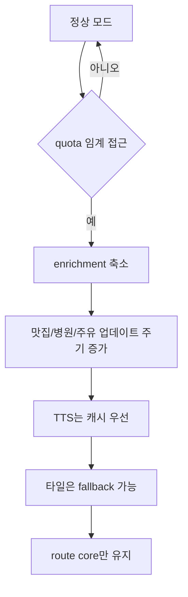

# Web-First Navigation Architecture 2026-04-19

이 문서는 `앱 전환 전`, `Railway + 웹 배포`를 유지하면서도 TMAP에 가까운 안내 품질을 목표로 하는 정석 아키텍처 초안이다.

핵심 원칙은 네 가지다.

1. `웹을 유지`한다.
2. `현재 Leaflet+raster 구조는 단계적으로 교체`한다.
3. `TMAP`, `NGII`, `ITS`를 역할별로 분리한다.
4. `Railway는 운영 API 서버`, `정밀지도 배치는 별도 전처리 계층`으로 둔다.

---

## 1. 목표

이 구조가 해결해야 하는 실제 문제는 아래다.

- 안내 시작 후 차량 기준 화면 추종이 어색하다.
- 분기/합류/진출을 실제 도로처럼 이해하기 어렵다.
- 분홍/초록 유도선 같은 TMAP식 안내를 웹에서 충분히 못 보여준다.
- route, camera, hazard, POI, 맛집이 한 구조에 섞여 과금과 장애가 함께 전파된다.

따라서 목표는 기능 추가가 아니라 구조 분리다.

- `route core`
  - 경로 탐색, 진행률, 재탐색, maneuver, camera core
- `geometry rendering`
  - 현재 경로 주변 정밀 형상
- `event enrichment`
  - 공사, 돌발, VMS, POI, 맛집, 병원
- `ops/quota`
  - 캐시, circuit breaker, safe mode

---

## 2. 데이터 소스 책임

| 계층 | 책임 | 원천 |
|---|---|---|
| Route/TBT | 실제 길찾기, TBT, lane hint, safetyFacilityList | TMAP |
| Static HD Geometry | 차선 중심선, 램프, 분기/합류, road boundary | NGII 정밀도로지도 |
| Dynamic Road Events | 공사, 사고, 기상, 재난, VMS, 가변속도 | ITS / 공공 API |
| UX Enrichment | 주유소, 병원, 맛집, Google 평점 | 개별 외부 API |
| User History | 실제 주행 기록, 운전 습관, 저장 경로 | 자체 서버/스토리지 |

중요한 분리 규칙:

- `TMAP 응답`은 실시간 route/tbt에만 쓴다.
- `정적 geometry`는 NGII/자체 저장소에서 가져온다.
- `사건 데이터`는 ITS에서 붙인다.
- `맛집/병원/유가`는 core route와 분리한다.

---

## 3. 전체 구조

```mermaid
flowchart LR
    U[웹 클라이언트\nReact + MapLibre GL JS] --> BFF[Railway BFF API]
    BFF --> TMAP[TMAP Route / TBT / Lane Meta]
    BFF --> ITS[ITS Events API]
    BFF --> ENRICH[Fuel / Hospital / Places APIs]
    BFF --> CORRIDOR[Corridor Geometry API]
    CORRIDOR --> PG[(PostGIS / Geometry Store)]
    ETL[NGII ETL Pipeline\nSHP -> PostGIS] --> PG
    CACHE[(Runtime Cache / Disk Cache)] <-- BFF
    HISTORY[(User Drive History)] <-- BFF
```

설명:

- 웹 클라이언트는 더 이상 외부 API를 직접 많이 치지 않는다.
- Railway BFF가 `route core`, `enrichment`, `corridor`를 분리해서 응답한다.
- 정밀도로지도는 배치 ETL로 PostGIS에 적재하고, 운영 중에는 corridor만 잘라서 쓴다.

---

## 4. 클라이언트 구조

### 4-1. 지도 엔진

- 현 구조:
  - `React + Leaflet + raster tile`
- 목표 구조:
  - `React + MapLibre GL JS + vector style`

교체 이유:

- bearing/pitch/offset 상태 제어가 훨씬 안정적이다.
- route source, camera source, event source, corridor source를 레이어 단위로 분리할 수 있다.
- 운전자 모드와 미리보기 모드를 같은 엔진에서 상태 전환하기 쉽다.

### 4-2. 렌더 레이어

클라이언트는 아래 6개 레이어를 독립 관리한다.

1. `base-map-layer`
- 일반 지형/라벨/도로

2. `route-core-layer`
- 남은 경로
- 지나온 실제 경로
- 현재 세그먼트
- 다음 1~2개 세그먼트

3. `corridor-geometry-layer`
- 본선 외곽
- 램프
- 분기/합류 형상
- 차로 중심선

4. `guideline-layer`
- 분홍/초록/파랑/노랑 유도선
- lane hint에 따라 강조되는 경로

5. `safety-event-layer`
- 카메라
- 구간단속
- 공사/사고/기상/재난

6. `enrichment-layer`
- 맛집
- 병원
- 주유소
- 주차장

### 4-3. UI 상태머신



핵심 규칙:

- `HomeNorthUp`
  - 홈 지도. 북업 고정.
- `NavDriverFollow`
  - 차량 하단 고정, 진행 방향 상단.
- `NavManual`
  - 사용자가 지도 만진 상태. 자동 복귀 버튼만 노출.
- `NavDecisionZoom`
  - 분기 전 확대.
- `NavInsetFocus`
  - 인셋과 유도선이 같이 강화되는 구간.

---

## 5. 서버 구조

### 5-1. BFF 계층 분리

Railway BFF는 아래 4개 모듈로 나뉜다.

1. `route-core`
- `/api/tmap/routes`
- `/api/tmap/road/nearestRoad`
- route validation
- progress/retry/budget/circuit breaker

2. `route-enrichment`
- `/api/road/actual-meta`
- `/api/road/events/nearby`
- `/api/fuel/*`
- `/api/hospital/*`
- `/api/restaurants/*`

3. `corridor-geometry`
- `/api/road/corridor`
- route polyline 기준 geometry 절단 응답

4. `ops-control`
- TTL cache
- inflight dedupe
- quota safe mode
- stale fallback

### 5-2. BFF 응답 원칙

중요한 원칙은 `route core와 enrichment를 절대 한 요청에서 강하게 결합하지 않는 것`이다.

- route core 실패:
  - 길찾기 자체 실패로 처리
- enrichment 실패:
  - route는 유지
  - 부가정보만 `정보없음`
- corridor 실패:
  - route는 유지
  - 인셋/차선형상만 축소 모드

즉, 맛집/병원/유가/ITS 장애가 내비 화면을 죽이면 안 된다.

---

## 6. 정밀도로지도 파이프라인

### 6-1. 왜 corridor만 써야 하나

전국 전체 geometry를 웹으로 바로 들고 오면 너무 무겁다.

그래서 현재 경로 주변만 잘라서 쓴다.

- route polyline을 buffer한다.
- buffer와 겹치는 geometry만 PostGIS에서 조회한다.
- 클라이언트에는 경량화된 GeoJSON 또는 vector tile만 보낸다.

### 6-2. 최소 레이어

초기 MVP에서는 아래 4개만 쓴다.

1. 차로 중심선
2. 분기/합류 connector
3. 램프 외곽 형상
4. road boundary simplification

이유:

- 이 4개만으로도 미니 인셋과 분기 강조가 크게 좋아진다.
- 차로경계선, 정지선, 노면표시까지 한 번에 다 넣으면 데이터량과 렌더링 비용이 급증한다.

### 6-3. ETL 흐름



### 6-4. corridor API 제안

`POST /api/road/corridor`

입력:

```json
{
  "routeId": "route-live-123",
  "polyline": [[37.5,127.0],[37.5003,127.01]],
  "progressKm": 12.4,
  "radiusM": 450,
  "includeLayers": ["laneCenter","connector","rampShape","roadBoundary"]
}
```

출력:

```json
{
  "routeId": "route-live-123",
  "progressKm": 12.4,
  "corridorHash": "abc123",
  "layers": {
    "laneCenter": { "type": "FeatureCollection", "features": [] },
    "connector": { "type": "FeatureCollection", "features": [] },
    "rampShape": { "type": "FeatureCollection", "features": [] },
    "roadBoundary": { "type": "FeatureCollection", "features": [] }
  },
  "ttlSec": 120
}
```

---

## 7. 안내 렌더링 구조

### 7-1. 상단 배너

상단 배너는 `명령`만 담당한다.

- `300m 후 우측 진출`
- `100m 후 본선 유지`
- `분홍색 유도선을 따라가세요`
- `1.5km 앞 과속카메라`

배너에 차선 모양을 다 넣지 않는다.

### 7-2. 미니 인셋

미니 인셋은 `형상 이해`를 담당한다.

- 본선
- 빠지는 램프
- 이어지는 다음 세그먼트
- 유도선 강조

즉 “무슨 명령인지”는 배너,  
“길이 실제로 어떻게 꺾이는지”는 인셋이 맡는다.

### 7-3. 지도 본판

지도 본판은 `현재 주행 실감`을 담당한다.

- 차량은 항상 화면 하단
- 진행 방향은 상단
- 현재 세그먼트는 강하게
- 다음 세그먼트는 보조 강조
- 분홍/초록 유도선은 해당 lane/connector를 따라간다

---

## 8. 과금/안정성 구조

### 8-1. quota safe mode



우선순위:

1. route core 유지
2. camera/hazard 유지
3. TTS는 cache 우선
4. 맛집/병원/Google 평점 축소
5. 지도 타일 fallback

### 8-2. 캐시 계층

- memory cache
  - inflight dedupe
  - 수 초 ~ 수 분 TTL
- disk cache
  - TTS mp3
  - route enrichment snapshot
- long-term store
  - user history
  - recorded drive
  - verified camera report

주의:

- TMAP 원데이터 장기 보관 금지
- 장기 보관은 자체 정규화 결과나 사용자 기록 위주

---

## 9. Railway 역할

Railway는 계속 쓴다. 다만 역할을 명확히 제한한다.

Railway에 적합:

- Node BFF 운영
- route/enrichment/corridor API
- memory/disk cache
- dev/prod 배포

Railway에 부적합:

- 전국 단위 SHP 원본 보관
- 무거운 ETL/타일 빌드 실시간 처리
- 대량 geometry 배치 변환

즉, Railway는 `운영 서버`,  
ETL/PostGIS는 `배치/데이터 서버`로 본다.

---

## 10. 단계별 전환 계획

### Phase 1. 현재 구조 보호

- route core와 enrichment 분리
- camera/hazard/banner/inset 구조 고정
- 429/403/400 보호 강화

### Phase 2. 지도 엔진 교체

- Leaflet -> MapLibre GL JS
- 운전자 카메라 상태머신 이관
- 기존 overlay layer source 재배치

### Phase 3. corridor geometry 도입

- NGII 최소 레이어 ETL
- PostGIS + corridor API
- 인셋/분기 렌더를 실제 geometry 기반으로 전환

### Phase 4. 유도선/차선 고도화

- extcVoiceCode와 connector 매칭
- 분홍/초록/파랑/노랑 유도선 실지도 렌더
- lane group 기반 차선 강조

### Phase 5. 운영 최적화

- quota safe mode 자동화
- TTS/disk cache 영구화
- dev smoke automation

---

## 11. 지금 당장 하지 말아야 할 것

- Leaflet 위에 차선/분기 표현을 계속 덧칠하기
- route core와 맛집/병원/주유를 한 요청에 묶어 과금과 장애를 공유하게 두기
- 전국 정밀도로지도를 한 번에 웹으로 보내기
- Railway에 원본 SHP 전처리까지 다 얹기

이 네 가지는 비용 대비 효과가 낮고, 구조를 더 꼬이게 만든다.

---

## 12. 최종 판단

현재 프로젝트는 `웹 유지`가 맞다.  
하지만 `현 구조 유지`는 아니다.

정확히는:

- 플랫폼은 웹 유지
- 지도 엔진은 교체
- geometry 데이터 계층은 추가
- Railway는 계속 사용
- route core와 enrichment는 분리

이 조합이 지금 가장 현실적이고,  
MVP와 장기 확장성을 동시에 만족시키는 경로다.
